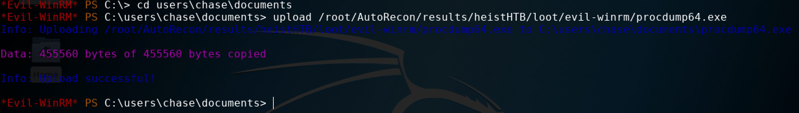
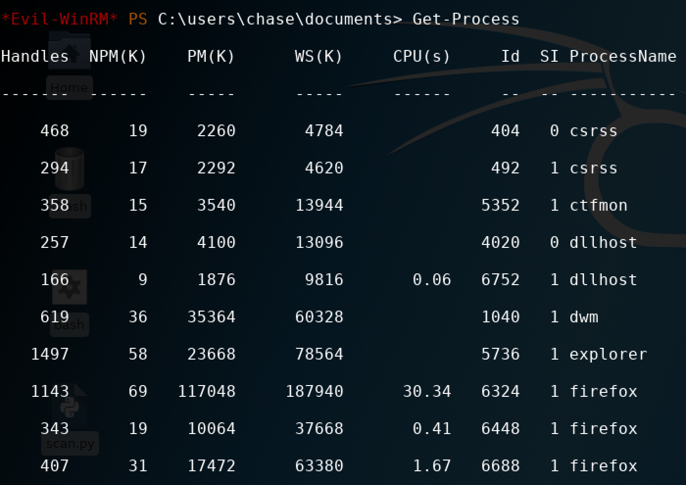
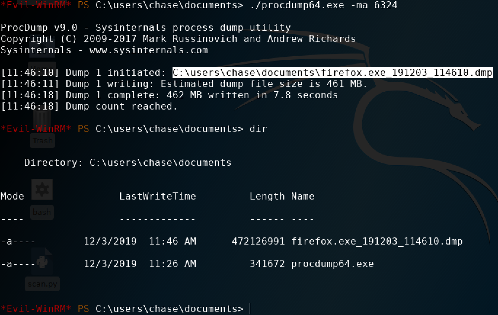

# Dumping memory on Windows

On 64-bit, there's `procdump64.exe`. 

Through `evil-winrm`, the upload function can be used to upload the executable. 

The `Sysinternals Suite` contains the executable. It contains both 32 and 64-bit. The download link:



Download it and unzip it, then upload it on the target through evil-winrm:



Now use `Get-Process` to get a list of running processes:



Accept the procdump eula:

```text
./procdump64.exe -accepteula
```

Then run `./procdump64.exe -ma [ID]` to dump a process's memory:




