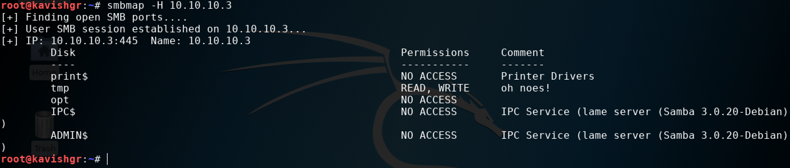
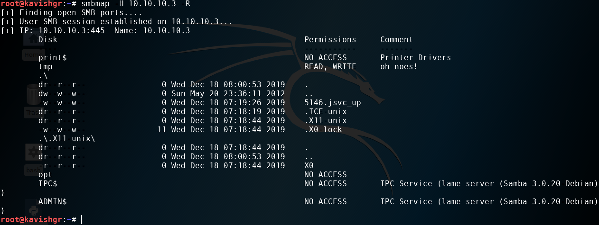
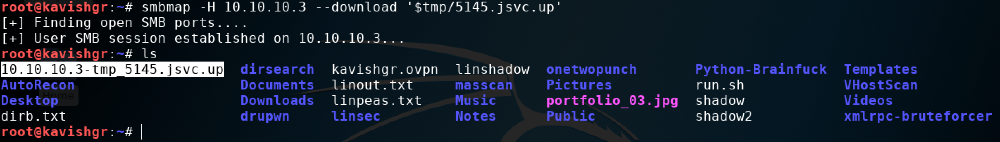
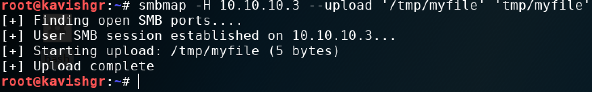
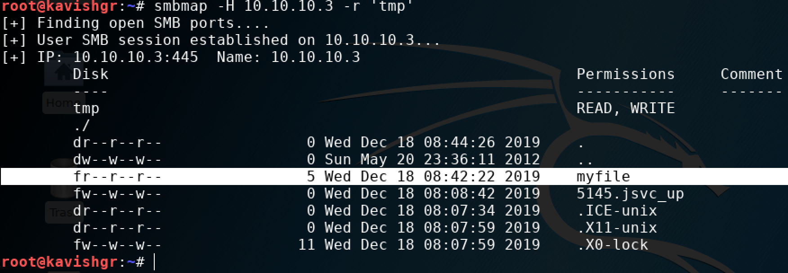
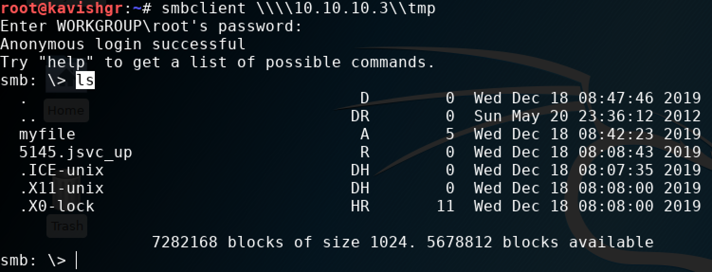
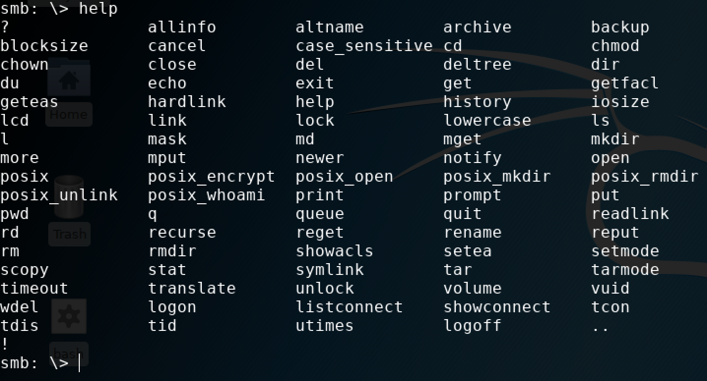
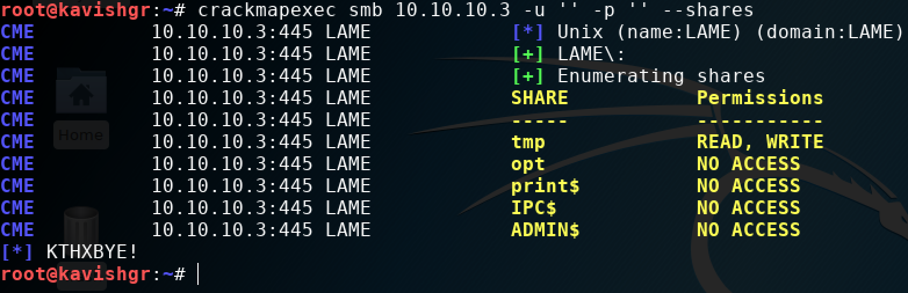

# 135/445 - Samba/smb/netbios-ssn/

[https://www.wonderhowto.com/](https://www.wonderhowto.com/)


SMB stands for server message block. It’s a protocol for sharing resources like files, printers, in general any resource which should be retrievable or made available by the server. It primarily runs on port 445 or port 139 depending on the server . It is actually natively available in windows, so windows users don’t need to configure anything extra as such besides basic setting up. In linux however ,it is a little different. To make it work for linux, you need to install a samba server because linux natively does not use SMB protocol.

* run the following to find out the version of the smb server:

```text
nmap -sC -p 139,445 -sV 10.10.10.3
```

## smbmap

SMBMap allows users to enumerate samba share drives across an entire domain. List share drives, drive permissions, share contents, upload/download functionality, file name auto-download pattern matching, and even execute remote commands. This tool was designed with pen testing in mind, and is intended to simplify searching for potentially sensitive data across large networks.



* **-H**: specify the host

We can see the samba version: **Samba 3.0.20-Debian**

The list of permissions on which share we have access or not. Sometimes credentials are needed to access the shares/domains.

* **-R**: recursively list directories, and files



**Only the shares with read/write access will get listed**. That's because anonymous access is allowed. In the real world, you'll to provide a username and password.

* **-P**: to specify a different port. By default it's 445.

### Downloading files



The syntax is: 

```text
smbmap -H 10.10.10.3 --download '$sharename/path_to_file'
```

Inside quotes, append a dollar sign '$' before the sharename followed by the file to download.

### Uploading files



The syntax is:

```text
smbmap -H 10.10.10.3 --upload 'SRC' 'DST'
```

The $ sign is mandatory on Linux\(not sure\).

Verify upload:




#### 

## smbclient

An ftp-like client to access SMB/CIFS resources on servers. The tool is part of the samba suite.

The syntax is:

```text
smbclient \\\\10.10.10.10\\sharename
```



List of available commands:




## crackmapexec

### List shares and permissions



The syntax is:

```text
crackmapexec smb 10.10.10.3 -u '' -p '' --shares
```

Leave **-u** ' ' and **-p** ' ' blank to verify if a null/anonymous session is available.

## Tips

Knowing the version of Samba, the different shares we have available to potentially access \(and maybe write to\) as well as the list of users on the box gives us several options for gaining access.

1. Brute force
2. If we can find a Local File Inclusion vulnerability in a web app on the server and a writable share on the Samba service, we can have the web server execute the code of our choosing.
3. Remote Code Execution or some other exploit on the Samba service itself.

