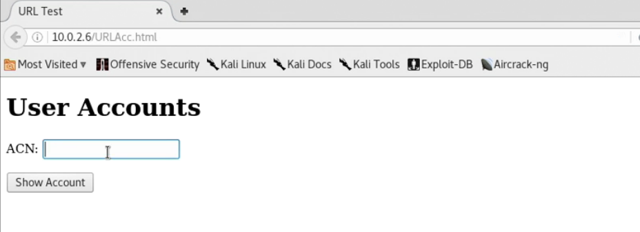
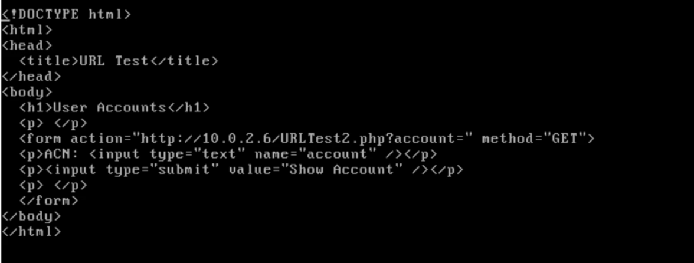
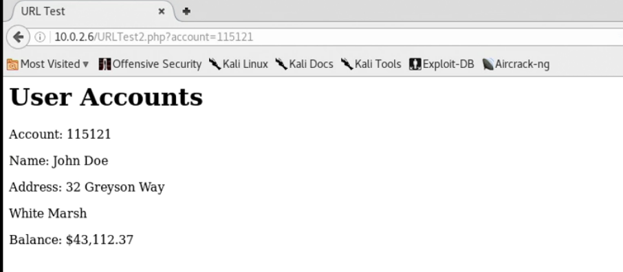
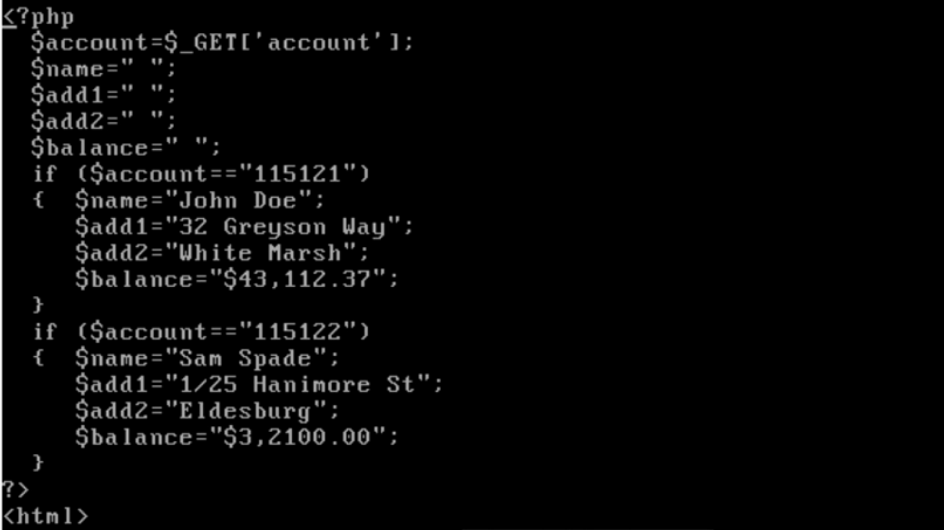
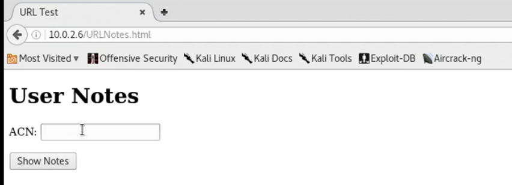
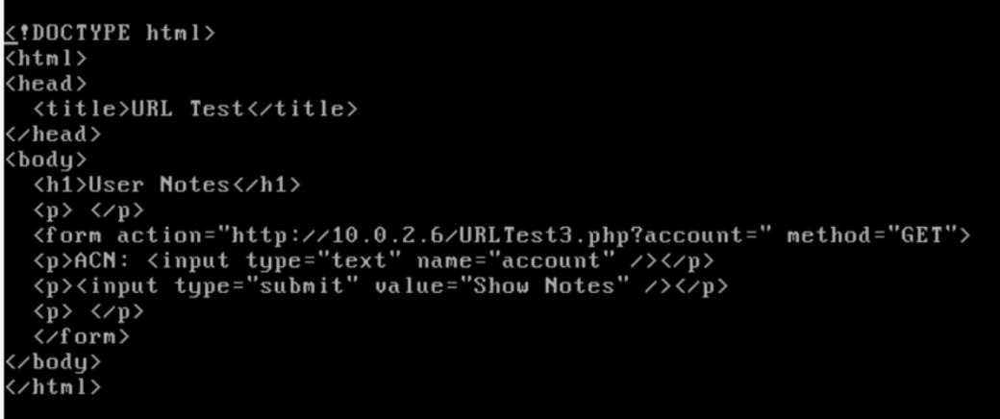
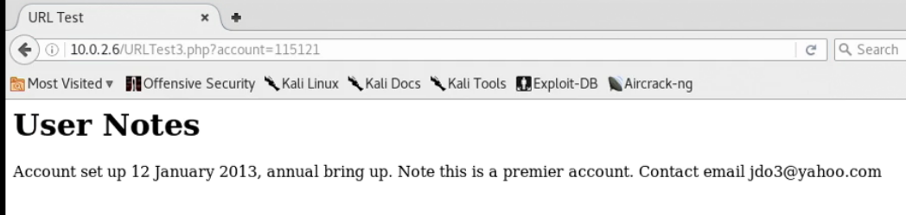
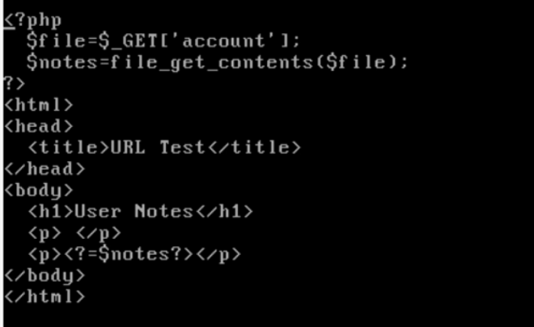
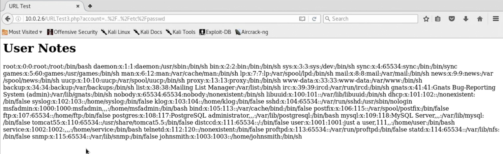

# 80 - HTTP/Web Apps

## Nikto

## Brute Force Directories

## Command Injection







## URL Manipulation

An automated input hack manipulates a URL and sends it back to the server, telling the web application to do various things, such as redirect to third-party sites, load sensitive files off the server, and so on. Local file inclusion is one such vulnerability.

### Basic Demo with PHP from metasploitable2

Here's a form that accepts an account ID for submission:

Here's the source code:

When an account ID is submitted, and the `Show Account` button is clicked, the form will send the ID as a value for the parameter `account` for the following url: `http://10.0.2.6/URLTest2.php?account=` as an HTTP GET request.

Let's input an ID and see what happens:

The above details was provided. Notice the url has changed. It's now `URLTest2.php`. Let's take a look at its source code:

It's in PHP. The account parameter\(or as a variable locally\) will contain the submitted ID as its value. Then if the ID is valid, display the required details. In the real world, those details would reside on a database, but the same logic applies.

Now let's take a look at the following page `URLNotes.html`:

The source code:

The same thing as `URLAcc.html`. It redirect the page to `URLTest3.php` if a valid account is provided:

Source code:

The file variable will have the ID as its value. Based on the second line, the account ID is a file on the system, and html will display the file's content in a paragraph tag.

Since PHP is retrieving file on the system, the url can be manipulated to view sensitive information/files:

The content `/etc/passwd` of password. In this case `.` and `/` was acceptable characters. In the url, `/` was html encoded to `%2F`. The full URL is `[IP]/URLTest3.php?account=..%2F..%2Fetc%2Fpasswd`.

## SQL Injection

