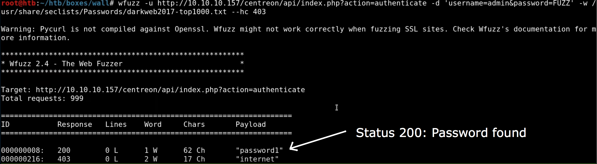

# wfuzz

Wfuzz can be used to look for hidden content, such as files and directories, within a web server, allowing to find further attack vectors. It is worth noting that, the success of this task depends highly on the dictionaries used.

* `-d`: For post-data
* `--hc`: Hide codes
* `-L`: Follow redirections
* `-c`: Output with colors
* `-X`: Specify methods

### Post Data Fuzzing

Use the `-d` flag:

```text
wfuzz -u http://[URL] -d 'username=admin&password=FUZZ' -w /usr/share/seclists/Passwords/darkweb2017-top1000.txt -hc 403
```

Output:



or

```text
wfuzz -c -w /usr/share/seclists/Passwords/darkweb2017-top1000.txt -d "username=admin&password=FUZZ&login=login" --hc 403 'URL'


```

