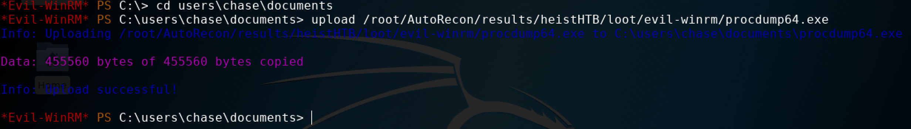
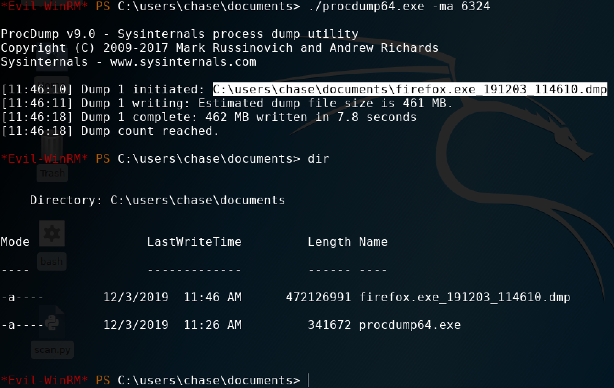
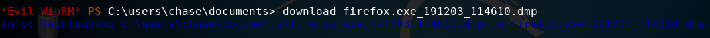
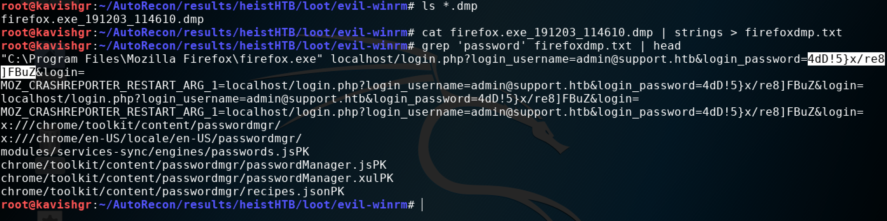

# Dumping memory on Windows

On 64-bit, there's `procdump64.exe`. 

Through `evil-winrm`, the upload function can be used to upload the executable. 

The `Sysinternals Suite` contains the executable. It contains both 32 and 64-bit. The download link:



Download it and unzip it, then upload it on the target through evil-winrm:



Now use `Get-Process` to get a list of running processes:


Accept the procdump eula:

```text
./procdump64.exe -accepteula
```

Then run `./procdump64.exe -ma [ID]` to dump a process's memory:



Now you can download the dmp file on your attacking machine and view the content. This can take a long time depending on the size. Wait at leasts 10 mins. While its downloading you can can still view the file and see if the information you need is already there.  
  
Downloading the dump:



The dump will download in the directory you ran `evil-winrm` from. Pipe the output to `strings` and redirect it to a file and grep for the contents you were looking for:



