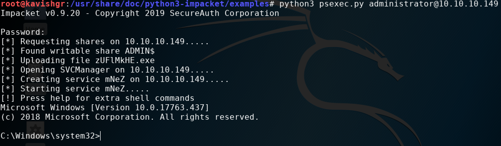

# psexec.py

PsExec is a light-weight telnet-replacement that lets you execute processes on other systems, complete with full interactivity for console applications.





psexec.py will spawn a shell for the specified user only if the `ADMIN$` and `C$` shares are writable:

We can verify this with `crackmapexec.`

 Notice the `(Pwn3d!)` 🥳   
This means the user has write access on both `ADMIN$` and `C$`.

Now run `psexec.py`

